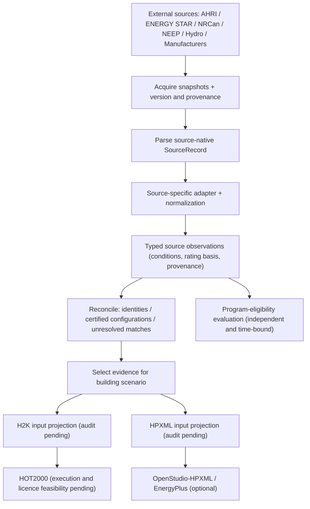

# Equipment evidence → modeling interoperability (lab v0.1)

Status: **experimental lab contract**. No SRVX repo edits, database seeding, promotion, scraping, or source-specific canonical Supply identity.

## Data flow

### Distinct responsibilities

- **Dataset discovery/registry:** availability, family coverage, licences, snapshots, schema fingerprints, access constraints.
- **Ingestion:** acquisition of source evidence, with reproducible metadata, subject to access/terms.
- **Parsing:** faithfully decode foreign file/layout into typed `SourceRecord`; no cross-source identity claims.
- **Adapter / normalization:** source field mappings into typed observations, including units, test conditions, measurement type, rating method, edition, provenance. This is often one source-specific implementation; the vocabulary is reusable.
- **Evidence reconciliation:** exact matches first; mismatches or uncertainty remain unresolved. AHRI configurations may have multiple indoor/outdoor models. Do not merge component and system identities.
- **Projection:** explicitly transform accepted evidence into *target version's* required fields, track missing assumptions, and fail closed when unsupported. Do not assume HPXML-to-H2K or IFC-to-H2K conversion exists.
- **Program evaluation:** Hydro/other subsidy status is **not** an intrinsic equipment rating, certification or identity.
- **SRVX promotion:** out of scope and requires its own later decision.

## H2K and HPXML vocabulary reuse

Use existing system semantics rather than create competing systems:

| Domain | Existing HPXML / OpenStudio-HPXML concept | Lab observation family | H2K mapping |
|---|---|---|---|
| Central/room AC | CoolingSystem | CoolingPerformance | Pending actual field audit |
| Air-source heat pump | HeatPump | HeatPumpPerformance + CoolingPerformance | Pending |
| Gas/oil furnace | HeatingSystem, furnace subtype | CombustionHeatingPerformance | Pending |
| Boiler | HeatingSystem, boiler subtype | CombustionHeatingPerformance | Pending |
| Water heater incl heat-pump WH | WaterHeatingSystem | WaterHeatingPerformance | Pending |
| Ground-to-air / water-loop-to-air heat pump | HeatPump, appropriate subtype | GroundSourcePerformance | Pending |

Names above are *semantic alignments*, **not** completed mappings. OpenStudio-HPXML carries simulation-specific assumptions and detailed performance rules beyond the base HPXML vocabulary. Do not alias measured min/nominal/max values. Pin HPXML version and OpenStudio-HPXML rules before implementing projections. H2K encoding must be examined from actual representative H2K inputs and translator source.

References: https://openstudio-hpxml.readthedocs.io/ ; https://www.hpxmlonline.com/ ; https://github.com/canmet-energy/h2k-hpxml

## Equipment source registration

See `registry/source-datasets.v0.1.json` for sources, licensing gates and expected roles. Treat availability per family as **candidate coverage**, not completeness. In particular ENERGY STAR and NRCan may not cover every AHRI subcategory.

## Minimal evidence contract (v0.1)

An observation must provide:
- `source.datasetId`, `source.sourceRecordId`, `source.sourceField`, `source.snapshotId`, `source.retrievedAt`.
- `family`, `contract`, `metric`, `value`, `unit`, and `evidenceKind`.
- `conditions` (may be empty only for inherently unconditional source facts; preserve test context).
- `ratingBasis` (may be null if no rating standard is asserted).
- `equipmentIdentity` source-native identifiers only; unresolved matching is valid.

Neither `certified` nor `subsidyEligible` is inferred from performance. Don't calculate capacity retention in this normalized layer; calculations belong to explicit downstream analyses.

## Execution phases and acceptance gates

1. **Registry/vocabulary** (this branch): enumerate six families and sources, preserve uncertainty and terms checks.
2. **Contracts and fixtures** (this branch): machine-check observation and family metric coverage; include synthetic fixtures clearly flagged.
3. **Source adapters** (deferred): choose one legally usable snapshot each; map sources independently, with field-level lineage.
4. **Matching** (deferred): explicit components/configurations; exact match and unresolved cases, auditable provenance.
5. **Projection feasibility** (deferred): one furnace or water heater + one heat pump, H2K and HPXML field-by-field; validators, fallback reports.
6. **Canonical Supply** (deferred): no SRVX identities or data publication until explicit promotion review.

### Collaboration rules

Parallel research windows should add a versioned `SourceRecord` schema and fixture for their dataset, record permission/status, and a source-to-observation mapping table. They must not edit common contracts without a reviewed version bump, or insert target XML fields into source normalization. Do not use AHRI directory scraping or NEEP datasets for commercial use without appropriate permission.
